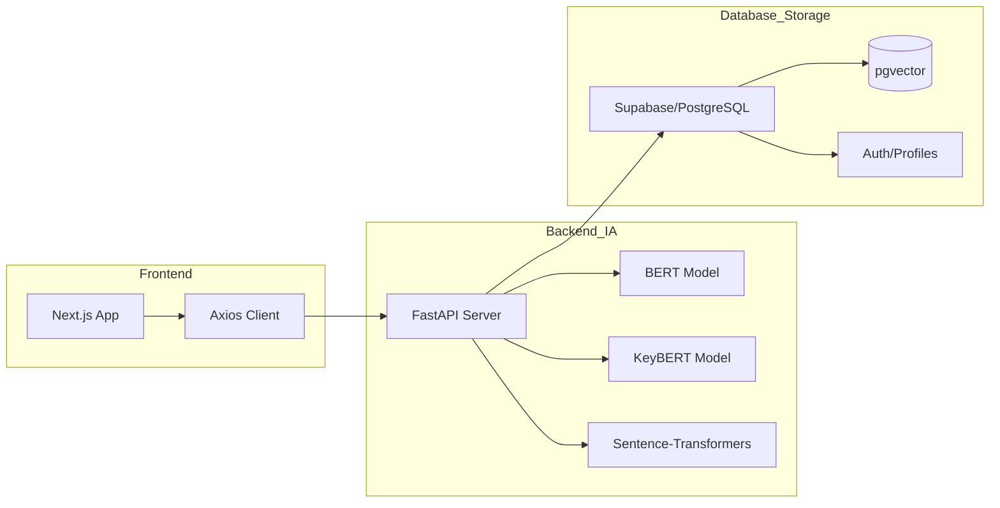

# 📊 Trame de Présentation : Plateforme CONNEX

---

## 🏗️ Slide 1 : Titre & Introduction
- **Visuel :** Logo Connex au centre (`logo.png`)
- **Titre :** **Connex** : Plateforme Intelligente de Partage d'Expériences Professionnelles
- **Sous-titre :** Projet d'Arch4itecture de Données & Intelligence Artificielle
- **Équipe :** Chaymaa AMDAAI, RIYADH, MEHDI
- **EMSI 2026**

---

## 📑 Slide 2 : Sommaire
1. Contexte & Problématique
2. La Solution Connex
3. Objectifs & Valeur Ajoutée
4. **Architecture Technique & Diagramme**
5. Stack Technologique
6. Flux de Données (Data Pipeline)
7. Le Moteur IA (Sentiment & Thèmes)
8. Recherche Sémantique & Vectorielle
9. Dashboard & Business Intelligence
10. Monitoring & Docker
11. Conclusion & Perspectives

---

## 🔍 Slide 3 : Contexte & Problématique
- **Le Silence des Données :** Des milliers d'expériences sont partagées sur le web sans être analysées.
- **Opacité :** Difficulté pour les talents de connaître la réalité interne des entreprises.
- **Besoin :** Automatiser la transformation de textes bruts en **insights actionnables**.

---

## 💡 Slide 4 : Connex : La Solution
- **Concept :** Un hub social professionnel qui "comprend" le contenu.
- **Innovation :** Analyse automatique du climat social via les témoignages.
- **Cible :** Étudiants, Professionnels en quête de mobilité, et RH.

---

## 🎯 Slide 5 : Objectifs du Projet
- **Intelligence :** Dépasser la simple recherche textuelle par la recherche sémantique.
- **Transparence :** Générer un "Score de Satisfaction" objectif basé sur l'IA.
- **Scalabilité :** Architecture prête pour le Big Data.

---

## 🛠️ Slide 6 : Architecture du Système (Diagramme)
*Visuel : Diagramme de flux technique.*

---

## 💻 Slide 7 : Stack Technologique
- **Frontend :** Next.js 16, TailwindCSS, Shadcn/UI.
- **Backend :** FastAPI, Python, Pydantic.
- **Base de Données :** Supabase, PostgreSQL, pgvector.
- **Modèles IA :** HuggingFace (BERT, MiniLM).

---

## 🔄 Slide 8 : Pipeline de Données (Ingestion)
- **Collecte :** Ingestion via API REST (Experiences/Stories).
- **Nettoyage :** Normalisation du texte et gestion des encodages (UTF-8).
- **Synchronisation :** Liaison temps réel entre Supabase Auth et les profils métiers.

---

## 🤖 Slide 9 : Le Moteur IA (Sentiment & Keywords)
- **Analyse de Sentiment :** Utilisation de **BERT** pour classer le ton (Positif/Neutre/Négatif).
- **Extraction de Thèmes :** Identification des mots-clés stratégiques via **KeyBERT**.
- **Impact :** Scoring automatique de la perception de l'entreprise.

---

## 🚀 Slide 10 : Recherche Sémantique & Vectorielle
- **Le Cœur de l'Innovation :** Utilisation des **Embeddings** (Vecteurs).
- **Technologie :** Extension **pgvector** de PostgreSQL.
- **Avantage :** Compréhension du contexte (ex: "Ambiance" = "Bien-être").

---

## 📊 Slide 11 : Dashboard & Business Intelligence
- **Visualisation :** Graphiques Recharts dynamiques.
- **Insights RH :** Analyse des tendances et des points de douleur des employés.
- **Events :** Intégration d'événements pour booster l'engagement marque employeur.

---

## 🐳 Slide 12 : Déploiement & Fiabilité
- **Docker :** Conteneurisation complète (Frontend + Backend).
- **Health Checks :** Monitoring de la santé des services.
- **POC Seeding :** Jeu de données de 60 expériences pour démonstration réelle.

---

## 🏁 Slide 13 : Conclusion & Perspectives
- **Bilan :** Pipeline IA complet opérationnel.
- **Futur :** 
    - Notifications WebSockets temps réel.
    - Détection de Fake News via ML.
    - Migration Cloud Native (AWS).

---
**MERCI POUR VOTRE ATTENTION.**
