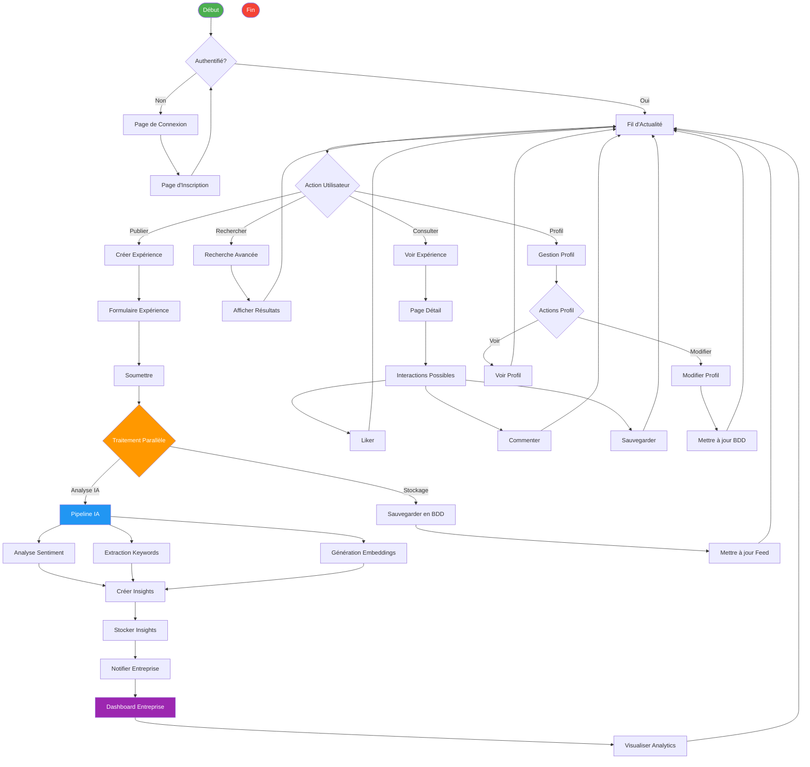
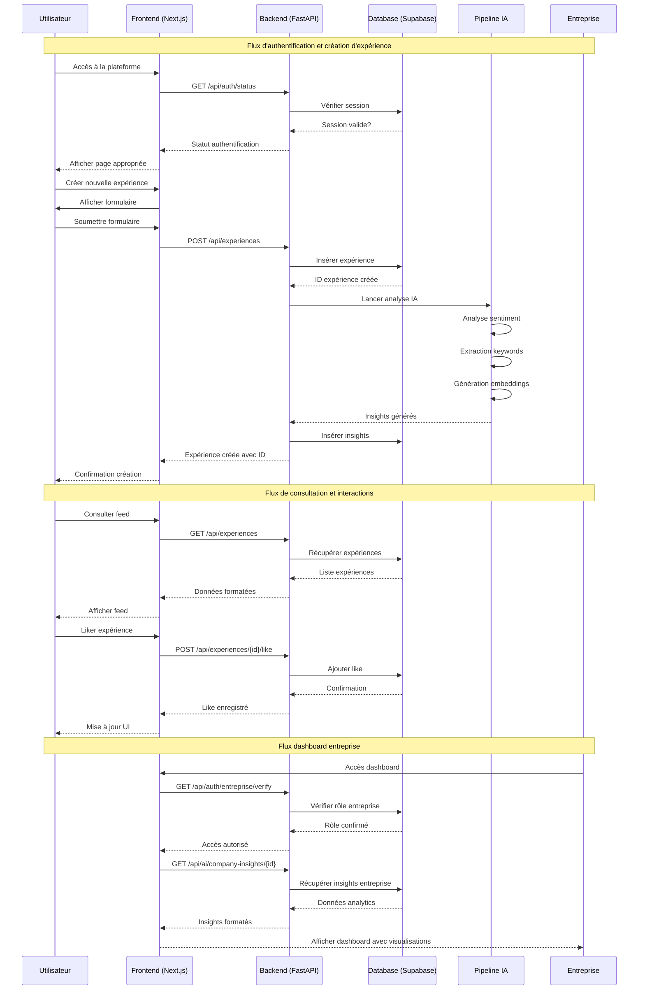
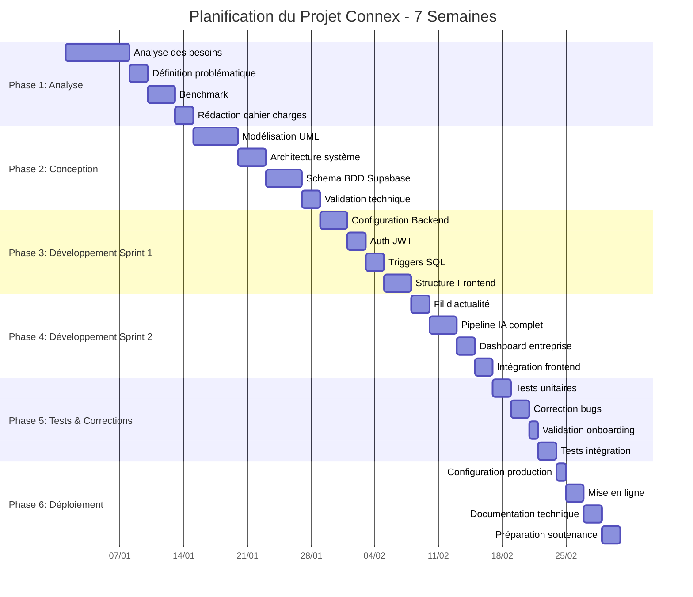
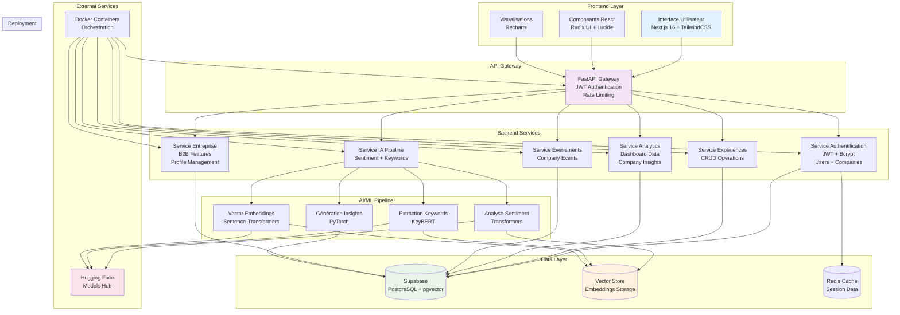
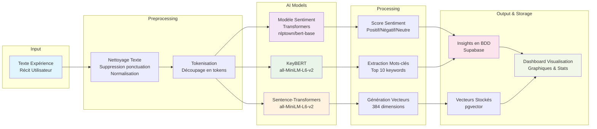

# Diagrammes du Projet Connex

## 1. Diagramme de Cas d'Utilisation (Use Case)

```mermaid
graph TD
    subgraph "Plateforme Connex"
        UC[Connex Platform]
    end
    
    subgraph "Acteurs"
        U[Utilisateur]
        E[Entreprise]
        A[Administrateur]
    end
    
    subgraph "Fonctionnalités Utilisateur"
        Auth[Authentification]
        Pub[Publication Expérience]
        Feed[Consultation Feed]
        Inter[Interactions Sociales]
        Rech[Recherche Avancée]
        Profil[Gestion Profil]
    end
    
    subgraph "Fonctionnalités Entreprise"
        Dashboard[Dashboard Analytics]
        Insights[Consultation Insights]
        Bench[Benchmarking]
        Percept[Analyse Perception]
    end
    
    subgraph "Fonctionnalités Administrateur"
        Mod[Moderation Contenu]
        GestUsers[Gestion Utilisateurs]
        Config[Configuration Système]
        Stats[Statistiques Globales]
    end
    
    U --> Auth
    U --> Pub
    U --> Feed
    U --> Inter
    U --> Rech
    U --> Profil
    
    E --> Dashboard
    E --> Insights
    E --> Bench
    E --> Percept
    
    A --> Mod
    A --> GestUsers
    A --> Config
    A --> Stats
    
    Auth --> UC
    Pub --> UC
    Feed --> UC
    Inter --> UC
    Rech --> UC
    Profil --> UC
    Dashboard --> UC
    Insights --> UC
    Bench --> UC
    Percept --> UC
    Mod --> UC
    GestUsers --> UC
    Config --> UC
    Stats --> UC
    
    style U fill:#e1f5fe
    style E fill:#f3e5f5
    style A fill:#fff3e0
```



## 2. Diagramme de Classes UML

```mermaid
classDiagram
    class Utilisateur {
        +int id
        +string email
        +string password_hash
        +string nom
        +string prenom
        +string role
        +datetime created_at
        +datetime updated_at
        +s'inscrire()
        +se_connecter()
        +modifier_profil()
        +publier_experience()
        +interagir()
    }
    
    class Experience {
        +int id
        +int utilisateur_id
        +int entreprise_id
        +string titre
        +text contenu
        +string secteur
        +datetime date_experience
        +datetime created_at
        +datetime updated_at
        +creer()
        +modifier()
        +supprimer()
        +analyser_ia()
    }
    
    class Entreprise {
        +int id
        +string nom
        +string secteur
        +string description
        +string logo_url
        +datetime created_at
        +datetime updated_at
        +get_insights()
        +get_analytics()
        +update_profil()
    }
    
    class Commentaire {
        +int id
        +int experience_id
        +int utilisateur_id
        +text contenu
        +datetime created_at
        +datetime updated_at
        +creer()
        +modifier()
        +supprimer()
    }
    
    class Like {
        +int id
        +int experience_id
        +int utilisateur_id
        +datetime created_at
        +ajouter()
        +retirer()
    }
    
    class Insight {
        +int id
        +int experience_id
        +int entreprise_id
        +float sentiment_score
        +string sentiment_label
        +array keywords
        +json themes
        +datetime created_at
        +generer()
        +analyser_sentiment()
        +extraire_keywords()
    }
    
    class Evenement {
        +int id
        +int entreprise_id
        +string titre
        +text description
        +date date_evenement
        +string type
        +datetime created_at
        +creer()
        +modifier()
        +supprimer()
    }
    
    class Sauvegarde {
        +int id
        +int utilisateur_id
        +int experience_id
        +datetime created_at
        +ajouter()
        +retirer()
    }
    
    Utilisateur ||--o{ Experience : publie
    Utilisateur ||--o{ Commentaire : écrit
    Utilisateur ||--o{ Like : donne
    Utilisateur ||--o{ Sauvegarde : sauvegarde
    Experience ||--o{ Commentaire : contient
    Experience ||--o{ Like : reçoit
    Experience ||--o{ Sauvegarde : est_sauvegardée
    Experience ||--|| Insight : génère
    Experience }o--|| Entreprise : concerne
    Insight }o--|| Entreprise : analyse
    Evenement }o--|| Entreprise : organisé_par
```

## 3. Diagramme d'Activité



## 4. Diagramme de Séquence



## 5. Diagramme de Gantt



## 6. Diagramme d'Architecture Système



## 7. Diagramme de Flux de Données IA



---

## Instructions pour utiliser ces diagrammes

### Dans Markdown
Copiez-collez le code Mermaid correspondant dans vos fichiers Markdown. La plupart des éditeurs modernes (VS Code, GitHub, GitLab) afficheront automatiquement les diagrammes.

### Dans le rapport
Pour inclure ces diagrammes dans votre rapport.md :
1. Copiez le code Mermaid souhaité
2. Ajoutez-le dans une section avec le titre approprié
3. Les diagrammes seront rendus automatiquement

### En ligne
Vous pouvez visualiser et modifier ces diagrammes sur :
- [Mermaid Live Editor](https://mermaid.live)
- [Mermaid Diagrams](https://mermaid-js.github.io/mermaid-live-editor)

### Pour la présentation
Exportez les diagrammes en images PNG/SVG depuis l'éditeur Mermaid pour les intégrer dans vos présentations PowerPoint ou Google Slides.
